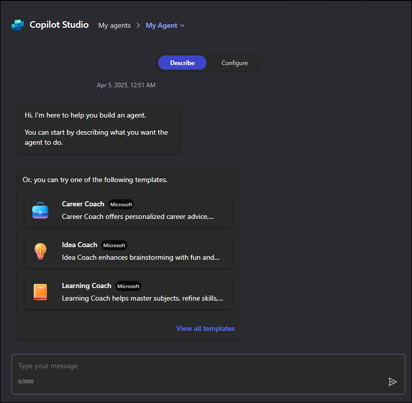
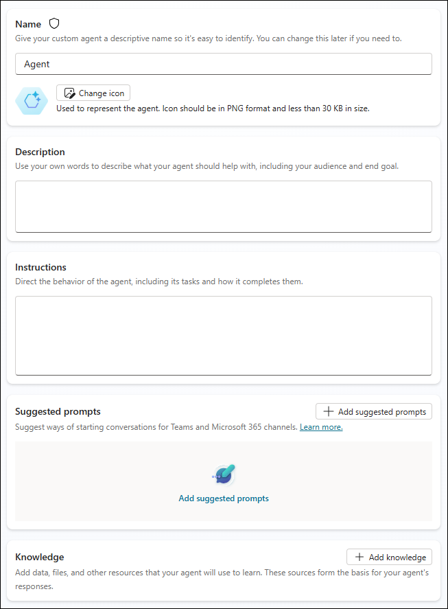
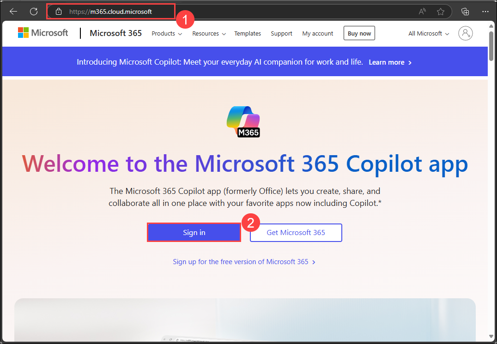
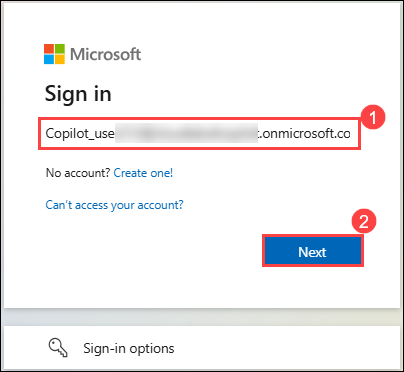
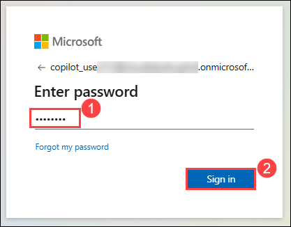
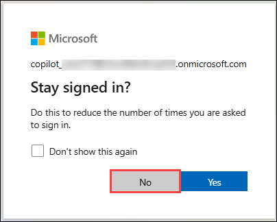
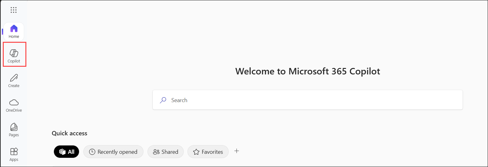
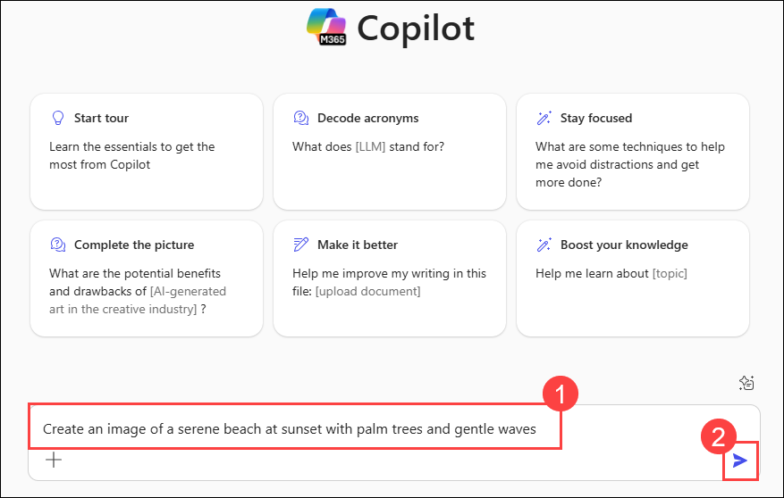
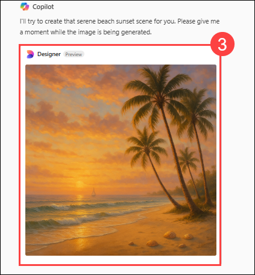

# Exercise 1: Explore Copilot Studio Agent Builder

### Estimated Duration: 30 minutes

## Overview

In this lab, you will explore the Image Generator capability powered by Microsoft Designer within the Microsoft 365 Copilot app. This feature enables declarative agents to generate visually appealing and contextually relevant images from user prompts. By navigating through the Copilot interface, you'll learn how to create graphics such as scenic illustrations and event flyers by simply entering descriptive text. The lab guides you through signing into the Microsoft 365 Copilot app, accessing the Visual Creator, and experimenting with real-world examples to experience the ease and creativity of AI-driven image generation.

## Overview of Copilot Studio agent builder

The Copilot Studio agent builder in Microsoft 365 Copilot enables you to build agents (also known as [declarative agents](https://learn.microsoft.com/en-us/microsoft-365-copilot/extensibility/overview-declarative-agent)) for Microsoft 365 Copilot easily and quickly.

Copilot Studio agent builder offers an immediate, interactive AI development experience within Microsoft 365 Copilot, which is perfect for quick and straightforward projects. If you need more advanced capabilities like Actions to integrate external services, we recommend that you use the full Microsoft Copilot Studio, which provides a comprehensive set of tools and features for more complex requirements.

Use the Copilot Studio agent builder to create and customize agents that can be used with Microsoft 365 Copilot to cover scenario-specific use cases, such as:

  - An agent that provides writing or presentation coaching tailored to organizational standards.
  - A team onboarding agent that responds with specific information about the user's new team and helps them complete onboarding tasks.

    

You can specify dedicated knowledge sources, including content on SharePoint and information provided by Microsoft Graph connectors. You can also test the agent before deploying it for use in your conversations with Microsoft 365 Copilot or sharing it with others in your organization.

You can build agents from the following apps and sites:

- microsoft365.com/chat
- office.com/chat
- Microsoft Teams Desktop and web client

  

## Build agents with Copilot Studio agent builder

The Copilot Studio agent builder provides a simple interface that you can use to quickly and easily build declarative agents, either by using natural language or manually.

- You can author your declarative agent in two ways:

  - Via the **Describe** tab, using natural language.
  - Via the **Configure** tab, where you can build it manually.

- **Describe your agent**: 

  The Describe tab allows you to create an agent using plain language. As you provide information conversationally, the agent's name, description, and instructions update continuously to refine the agent's behavior. This experience provides a rich yet simple natural language way to create a customized agent. After you create an agent, you can return to the agent and use the Describe tab to update it using natural language.

  You build agents in plain language by answering the questions the agent builder asks. The builder progressively updates the agent in each turn of the conversation, and changes are saved automatically. You can make updates to the agent in any turn of the conversation. Changes to the agent's name, description, and instructions update automatically. However, you can't add an icon or knowledge sources directly from the Describe tab. Use the Configure tab to add an icon, knowledge sources, or capabilities.

  

- **Configure your agent**:

  In addition to using the Describe tab, you can also directly configure the agent's behavior using the Configure tab. This method gives you more control and precision over your agent settings.

  Follow these steps to configure your agent manually:

  1. Navigate to the **Configure** tab at the top of the agent builder interface.
  2. Configure each of the following fields in sequence:

      
      

     a. **Name**: Enter a descriptive and unique name for your agent (30 characters maximum).
     
     b. **Icon**: Upload a PNG image (max 192x192 pixels, 1 MB) to give your agent a distinct visual identity. Images with transparent backgrounds work best.
     
     c. **Description**: Craft a clear description that helps the LLM understand your agent's purpose. This description will also appear in the app catalog.
     
     d. **Instructions**: Define how your agent should behave and what tasks it should perform. These instructions extend Microsoft 365 Copilot's capabilities (8,000 characters maximum). If you used the Describe tab first, these may be autogenerated. For guidance, see [Write effective instructions](https://learn.microsoft.com/en-us/microsoft-365-copilot/extensibility/declarative-agent-instructions).
     
     e. **Suggested Prompts**: Create example prompts to help users understand what your agent can do. Each prompt should have a name and description to guide users.

     f. **Knowledge**: Add up to 20 knowledge sources, which can include SharePoint sites, folders, files, or Microsoft Graph connectors. For detailed instructions, refer to the [Add knowledge sources](https://learn.microsoft.com/en-us/microsoft-365-copilot/extensibility/copilot-studio-agent-builder-build#add-knowledge-sources) documentation.

The Describe and Configure tabs stay synchronized as you work. Any changes you make in the Configure tab will be reflected when you return to the Describe tab, and vice versa. You can freely switch between tabs to use whichever approach works best for you at each stage of development.

## Best practices for effective agents

To create the most effective agents for Microsoft 365 Copilot:

1. **Be specific with instructions**: Clearly define what your agent should and shouldn't do.

2. **Curate knowledge sources carefully**: Choose high-quality, relevant content sources.

3. **Use natural language in descriptions**: Write descriptions that communicate your agent's purpose.

4. **Create helpful starter prompts**: Guide users with examples of effective queries.

5. **Iterate based on feedback**: Continuously improve your agent based on user experiences.

6. **Consider privacy and security**: Be mindful of the data sources you connect to your agent.

7. **Keep it focused**: Agents that do a few things well often perform better than those trying to do too much.

By following this complete process from creation through testing, deployment, and management, you can build effective agents that enhance productivity and provide specialized assistance through Microsoft 365 Copilot.

## Objective

- Task 01: Image generator

## Task 01: Image generator

The image generator capability enables declarative agents to generate images based on user prompts. Image generator uses the existing [Designer](https://designer.microsoft.com/) functionality to create visually appealing and contextually relevant graphics, and includes the following features:

1. Add a new tab in the Edge browser and open the Microsoft 365 Copilot app using the following link , and click on **Sign in** **(2)**.

     ```
     https://m365.cloud.microsoft/
     ```
     
     

2. On the **Sign into Microsoft Azure tab**, you will see a login screen. Enter the following email/username **(1)**, and then click on **Next** **(2)**.
   
   - **Email/Username:** <inject key="AzureAdUserEmail"></inject>

     

3. Now enter the following password **(1)** and click on **Sign in** **(2)**.

   - **Password:** <inject key="AzureAdUserPassword"></inject>

      
   
4. If you see the pop-up **Stay Signed in?**, click **No**.

   

5. From the left pane Select **Apps Launcher(1)** and click on **Microsoft 365 Copilot(2)**.

    

6. From the left pane in the **Microsoft 365 Copilot** window, select **Copilot Chat**. 

    

7. Let's try **Image generator** examples.

   - In the Text Box, enter **Create an image of a serene beach at sunset with palm trees and gentle waves** **(1)**, click on the **send** **(2)** button.

      

      

## Review

In this lab, you have used AI-powered tools to effortlessly generate compelling visuals from natural language prompts.

### You have successfully completed the lab!
